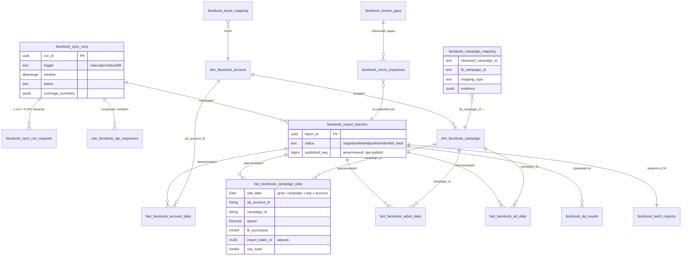

# Facebook Warehouse V2 — Design

- Дата: 2026-07-19
- Статус: design proposal, кода нет, deploy нет
- Основание: `FB_WAREHOUSE_DATA_QUALITY_AUDIT_2026-07-19.md`, `FB_COHORT_AUTHORITATIVE_AUDIT.md`, `FB_COHORT_LIVE_VALIDATION.md`
- Что заменяет: legacy Capsuled warehouse (`capsuled_facebook_stats/syncs`), interval Campaign metrics, `data_snapshots.facebook_traffic`, перезаписываемый sync state для FB

---

## 0. Диагноз, из которого вытекает дизайн

Аудит зафиксировал четыре архитектурных дефекта, каждый из которых V2 закрывает конкретным механизмом:

| Дефект сегодня | Последствие | Механизм V2 |
|---|---|---|
| Interval rows (183/231 legacy строк — агрегаты за 2–31 день) | Нельзя восстановить daily метрики, coverage непроверяем | Жёсткий grain `entity × day`; interval-строка = ошибка валидации, факт не записывается |
| Sync state перезаписывается upsert-ом (`clickhouse_transaction_sync_state`) | История sync невосстановима, gap 05-08..06-14 обнаружен через месяц | Append-only `facebook_sync_runs` + raw-слой с полным API response |
| Один mixed-таблица с колонкой `level` на 5 grains | Каждый читатель обязан фильтровать `level`, ошибки фильтра = двойной счёт | Отдельная fact-таблица на каждый grain |
| Нет версионирования: re-sync молча заменяет строки | Rollback невозможен, restate необнаружим | Append-only facts + batch lifecycle (staged → validated → published → rolled_back) |

Что аудиты подтвердили как **корректное** и что V2 сохраняет без изменений:

- allocation-алгоритм (`user_cpp = Campaign CPP`, Cohort Spend = SUM(user_cpp), статусная машина `fully_allocated/...`);
- fetch-стратегия активного пайплайна: day-level скан + entity levels по одному дню (обход merge-поведения Capsuled);
- validation gate «spend каждого level == day-level ground truth ± 0.05»;
- timezone resolution (payload → `FB_META_ACCOUNT_TIMEZONES_JSON` → default).

---

## 1. Data Model

### 1.1. Размещение

- **ClickHouse** — raw-слой, fact-таблицы, dimension-снепшоты, DQ/reconciliation результаты (всё большое и аналитическое).
- **Supabase Postgres** — control plane: `facebook_sync_runs`, `facebook_import_batches`, `facebook_campaign_mapping` (маленькое, транзакционное, RLS, редактируется из UI).
- Публикация batch дублируется в маленькую CH-таблицу `facebook_batch_registry`, чтобы CH-view могли фильтровать published-строки без federated-запросов.

### 1.2. Таблицы

#### Raw layer (ClickHouse, append-only, никогда не мутируется)

**`raw_facebook_api_responses`**
```
response_id        UUID
sync_run_id        UUID
request_seq        UInt32          -- порядковый номер запроса внутри run
level              LowCardinality(String)   -- account|campaign|adset|ad|day
request_date       Date            -- запрошенный день (V2 всегда однодневные запросы)
request_params     String          -- полный querystring/body
http_status        UInt16
response_body      String CODEC(ZSTD(6))    -- verbatim JSON от Capsuled
row_count          UInt32
received_at        DateTime64(3,'UTC')
ENGINE = MergeTree ORDER BY (sync_run_id, request_seq)
-- без TTL: именно отсутствие raw-слоя сделало gap 05-08..06-14 невосстановимым
```

#### Fact layer (ClickHouse, append-only MergeTree — не Replacing: версии разрешает view)

Общие технические колонки каждой fact-таблицы:
```
import_batch_id    UUID            -- ключ версионирования
sync_run_id        UUID
source_version     String          -- fbStatsTo / freshness-маркер Capsuled
row_hash           UInt64          -- sipHash от бизнес-ключа+метрик, для diff между batch
ingested_at        DateTime64(3,'UTC')
```

Хранятся **только метрики источника**: `spend Decimal(18,4)`, `impressions`, `reach`, `clicks`, `link_clicks`, `outbound_clicks`, `fb_purchases`, `purchase_value`, `currency LowCardinality(String)`. Производные (`cpp/cpc/cpm/ctr/roas`) в V2 **не хранятся** — считаются во view. Хранение ratio-метрик рядом с суммами (как сейчас) ломается при любой ре-агрегации.

**`fact_facebook_account_daily`** (в ТЗ — `fact_facebook_daily`)
```
stat_date Date, ad_account_id String, <метрики>, <тех.колонки>
ORDER BY (ad_account_id, stat_date, import_batch_id)
```

**`fact_facebook_campaign_daily`**
```
stat_date Date, ad_account_id String, campaign_id String, <метрики>, <тех.колонки>
ORDER BY (campaign_id, stat_date, import_batch_id)
```

**`fact_facebook_adset_daily`**
```
stat_date Date, ad_account_id String, campaign_id String, adset_id String, ...
ORDER BY (adset_id, stat_date, import_batch_id)
```

**`fact_facebook_ad_daily`**
```
stat_date Date, ad_account_id String, campaign_id String, adset_id String, ad_id String, ...
ORDER BY (ad_id, stat_date, import_batch_id)
```

Имена (`campaign_name` и т.п.) в facts **не хранятся** — только ID. Имена живут в dimensions (сегодня name дублируется в каждой строке и «дрейфует» при переименовании кампаний).

#### Dimension layer (ClickHouse, SCD2)

**`dim_facebook_account`**
```
ad_account_id String, account_name String,
buyer LowCardinality(String),           -- сегодня приходит из payload Capsuled
currency LowCardinality(String),
timezone String,                        -- IANA; источник: payload → env-map → default
valid_from DateTime64(3,'UTC'), valid_to Nullable(DateTime64), is_current UInt8,
import_batch_id UUID
ENGINE = ReplacingMergeTree ORDER BY (ad_account_id, valid_from)
```

**`dim_facebook_campaign`**
```
campaign_id String, ad_account_id String, campaign_name String,
funnel LowCardinality(String),          -- past_life|soulmate|... (парсится из name, правило версионируется)
first_seen_date Date, last_seen_date Date,
valid_from, valid_to, is_current, import_batch_id
ENGINE = ReplacingMergeTree ORDER BY (campaign_id, valid_from)
```

`dim_facebook_adset` / `dim_facebook_ad` — аналогично, по потребности UI (сначала можно view поверх facts).

#### Mapping layer (Postgres, редактируемый, аудируемый)

**`facebook_campaign_mapping`**
```
mapping_id uuid PK,
observed_campaign_id text NOT NULL,     -- ID из user-данных/UTM (то, что видим в когортах)
fb_campaign_id text NOT NULL,           -- реальный ID в FB warehouse
mapping_type text CHECK (confirmed_alias|url_template|manual|heuristic),
confidence numeric,                     -- 1.0 для confirmed
evidence jsonb,                         -- откуда знаем: URL template, скрин, тикет
status text CHECK (active|retired),
valid_from date, valid_to date,
created_by text, created_at, retired_at, retire_reason text
UNIQUE (observed_campaign_id, fb_campaign_id, valid_from)
```
Сюда переезжают 22 пары из хардкода `CONFIRMED_FB_CAMPAIGN_ALIASES` (`fbSourceClassification.ts:14-37`) — с evidence из mapping-аудита.

**`facebook_buyer_mapping`** — замена трижды продублированного хардкода `MEDIA_BUYER_BY_UTM_SOURCE`:
```
utm_source text, buyer text, valid_from date, valid_to date, status
```

#### Control plane (Postgres, append-only)

**`facebook_sync_runs`** — см. раздел 6.
**`facebook_sync_run_requests`** — по одной строке на API-запрос (child к runs).
**`facebook_import_batches`** — см. раздел 5.
**`facebook_known_gaps`** — окна, признанные невосстановимыми (например 2026-05-08..2026-06-14, если source probe вернёт пусто): `gap_from, gap_to, level, reason, evidence, decided_by, decided_at`. Reconciliation отличает «объяснённую дыру» от «неизвестной дыры».

#### DQ / Reconciliation (ClickHouse, append-only)

**`facebook_dq_results`** — результат каждой проверки каждого batch (раздел 4).
**`facebook_recon_snapshots`** — health-снепшоты после каждой публикации (раздел 8).

### 1.3. ER-диаграмма



### 1.4. Читающий слой (views поверх facts)

- **`v_fb_campaign_daily_current`** (и аналоги для остальных grain) — «текущая правда»:
  для каждого бизнес-ключа `(ad_account_id, campaign_id, stat_date)` берётся строка batch-а с максимальным `published_seq` среди `status = published`. Реализация: `argMax(metrics, published_seq)` + join/IN на `facebook_batch_registry`.
- **`v_fb_campaign_period`** — агрегат за произвольное окно, вычисляется из daily view. Заменяет сегодняшний `fbCampaignMetricsSql`; interval-агрегация становится **derived read-time view, а не storage format**.
- **`v_fb_campaign_resolved`** — daily view + LEFT JOIN mapping; выдаёт `match_kind = exact | mapped(mapping_id)`. Единственная точка, где mapping касается данных.

Все потребители (cohorts, FB Analytics, exports, blended-метрики) читают **только views**. Прямых чтений fact-таблиц вне views нет.

---

## 2. Grain

| Таблица | Grain (1 строка =) | Interval rows |
|---|---|---|
| `raw_facebook_api_responses` | 1 API request/response | допускаются (это сырьё) |
| `fact_facebook_account_daily` | Account × Date × batch | запрещены |
| `fact_facebook_campaign_daily` | Campaign × Date × Account × batch | запрещены |
| `fact_facebook_adset_daily` | AdSet × Date × Campaign × Account × batch | запрещены |
| `fact_facebook_ad_daily` | Ad × Date × AdSet × Campaign × Account × batch | запрещены |
| `dim_facebook_*` | Entity × валидный период (SCD2) | — |
| `facebook_sync_runs` | 1 запуск sync | — |
| `facebook_import_batches` | 1 атомарная порция загрузки | — |
| `facebook_dq_results` | 1 проверка × 1 batch | — |
| `facebook_recon_snapshots` | 1 published-состояние warehouse | — |

Правило, закрывающее главный дефект legacy: **строка источника с `dateFrom != dateTo` не может попасть ни в одну fact-таблицу.** Она фиксируется в raw-слое, batch получает hard-fail DQ `interval_row_guard`, окно перезапрашивается по дням. Три смысла даты из аудита (§6) разведены по местам навсегда: request window → `facebook_sync_runs.window`; activity interval → только raw; Meta reporting day → `stat_date` в facts.

Семантика `stat_date`: **Meta reporting day в timezone ad account** (как в активном пайплайне). Timezone фиксируется в `dim_facebook_account` и проверяется DQ-чеком.

---

## 3. Import pipeline

```
        Capsuled / Meta API
              │  однодневные запросы: day-скан окна,
              │  затем entity levels по одному дню (существующая стратегия)
              ▼
   ┌─ 1. RAW ───────────────────────────────┐
   │ каждый response verbatim →             │
   │ raw_facebook_api_responses             │   ничего не отбрасывается,
   │ + строка в facebook_sync_run_requests  │   даже ошибки и пустые ответы
   └────────────────┬───────────────────────┘
                    ▼
   ┌─ 2. VALIDATION (batch = staged) ───────┐
   │ • interval_row_guard: dateFrom==dateTo │  ← DEDUP #1: внутри batch
   │ • cross-level spend: каждый level ==   │    точные дубликаты (row_hash equal)
   │   day-level ± 0.05 (существующий gate) │    схлопываются; конфликтующие
   │ • duplicate business keys              │    дубликаты (тот же ключ, разные
   │ • currency/timezone consistency        │    метрики) = hard fail, batch
   │ • row caps / pagination completeness   │    остаётся staged
   └────────────────┬───────────────────────┘
                    ▼
   ┌─ 3. NORMALIZATION ─────────────────────┐
   │ • split по level → 4 fact-таблицы      │
   │ • names → dim_* (SCD2 diff)            │
   │ • производные метрики отбрасываются    │
   │ • stat_date из row.date (reporting day)│
   └────────────────┬───────────────────────┘
                    ▼
   ┌─ 4. WAREHOUSE (batch = validated) ─────┐
   │ append INSERT в facts с import_batch_id│  ← DEDUP #2: между batch-ами
   │ post-load DQ (coverage, reconciliation)│    решается НЕ при записи, а при
   │ publish → status=published,            │    чтении: argMax(published_seq)
   │ published_seq++, зеркало в CH registry │    по бизнес-ключу. Re-sync дня =
   └────────────────┬───────────────────────┘    новый batch, старый виден в истории
                    ▼
   ┌─ 5. ANALYTICS ─────────────────────────┐
   │ v_fb_*_daily_current → v_fb_campaign_  │
   │ period → fbCohortStats allocation,     │
   │ FB Analytics UI, exports, blended      │
   │ + facebook_recon_snapshots после       │
   │   каждой публикации                    │
   └────────────────────────────────────────┘
```

Точки deduplication — явные и их две:

1. **Внутри batch (validation):** точный дубликат (одинаковый `row_hash`) — схлопывается с записью в счётчик `merged_rows`; конфликтующий дубликат бизнес-ключа — hard fail. Это формализует сегодняшние `aggregateRows`/`mergedRowsDetected`, но с гарантией «конфликт не суммируется молча».
2. **Между batch (read-time):** facts append-only, побеждает строка последнего published batch. Ни UPDATE, ни ReplacingMergeTree-магии на бизнес-данных — конфликт версий всегда воспроизводим и откатываем.

Batch публикуется **атомарно на всё окно**: либо все levels всех дней окна прошли DQ и опубликованы, либо batch целиком остаётся staged. Частичная публикация запрещена — именно частичные состояния сделали legacy coverage непроверяемым.

---

## 4. Data Quality (встроенные проверки)

Каждая проверка = строка в `facebook_dq_results`:
```
batch_id, check_name, scope (date|campaign|account|buyer|batch),
scope_key, expected, actual, delta, status (pass|warn|fail), details JSON, checked_at
```

| # | Проверка | Логика | Gate |
|---|---|---|---|
| 1 | `coverage_by_date` | expected active days = дни с ненулевым day-level spend в окне; каждый такой день имеет строки на всех 4 grain | **hard** |
| 2 | `coverage_by_campaign` | множество campaign_id из day/campaign level == множество из adset/ad rollup; плюс сравнение с FB-candidate campaigns из authoritative cohorts за окно | hard (внутр.) / warn (vs cohorts) |
| 3 | `coverage_by_buyer` | каждый buyer с активными аккаунтами (dim) имеет строки в окне | warn |
| 4 | `coverage_by_account` | каждый аккаунт с day-level spend присутствует на всех levels; отдельный контроль sentinel-аккаунтов (`act_2486811861722169`) | **hard** |
| 5 | `coverage_pct` | covered Campaign×date / expected Campaign×date, по окну и cumulative | метрика, порог в recon |
| 6 | `missing_campaigns` | FB-candidate campaign_id из когорт, отсутствующие в published facts за их активные даты; после вычета `facebook_known_gaps` | warn + список |
| 7 | `duplicate_campaigns` | (a) дубликат бизнес-ключа в batch — **hard**; (b) одинаковый normalized name у разных campaign_id — warn, кандидаты в mapping (кейс duplicated campaigns из mapping-аудита) | hard / warn |
| 8 | `spend_reconciliation` | SUM(ad) == SUM(adset) == SUM(campaign) == SUM(account) == day-level, per date, ± 0.05 | **hard** |
| 9 | `purchase_reconciliation` | fb_purchases (campaign×date) vs trial users из `analytics_transactions`/`fact_user_cohorts` по exact campaign_id; расхождение записывается с направлением | warn |
| 10 | `interval_row_guard` | ни одной строки с dateFrom != dateTo после нормализации | **hard** |
| 11 | `currency_timezone_consistency` | одна currency на аккаунт в окне; timezone evidence присутствует (payload или env-map) | **hard** |

Hard-fail → batch не публикуется никогда; warn → публикация разрешена, факт warn виден в recon snapshot. Это generalization сегодняшнего validation gate: он остаётся, но результат перестаёт быть эфемерным — сохраняется на каждый batch.

---

## 5. Versioning

Единица версионирования — **import batch**, а не строка.

**`facebook_import_batches`** (Postgres):
```
batch_id uuid PK,
sync_run_id uuid REFERENCES facebook_sync_runs,
batch_type text CHECK (incremental|full|backfill|correction),
window_from date, window_to date,
source_version text,                 -- fbStatsTo/freshness Capsuled на момент выгрузки
status text CHECK (staged|validated|published|rolled_back|superseded),
published_seq bigint UNIQUE,         -- назначается только при publish, монотонно
row_counts jsonb,                    -- per level
created_at, validated_at, published_at, rolled_back_at, rollback_reason text
```

Как закрываются требования:

- **version** — `published_seq`: полный порядок публикаций; «состояние warehouse на момент X» = множество batch-ей с `published_seq <= X`, воспроизводимо любым view.
- **source_version** — на batch и на каждой fact-строке; restate со стороны Capsuled различим от нашего re-import.
- **import_batch** — на каждой строке; diff двух версий одного дня = сравнение `row_hash` строк двух batch-ей, тривиальный SQL.
- **backfill** — `batch_type = backfill` с любым историческим окном. Заливается staged → гоняется полный DQ → публикуется. До publish невидим для analytics: backfill gap-а 05-08..06-14 можно готовить и проверять сколько угодно, не трогая production-цифры. Это ровно «изолированная version/staging area» из рекомендаций аудита, но как штатный механизм, а не разовая процедура.
- **rollback** — `status = rolled_back` (одна строка в Postgres + зеркало в CH registry). Строки batch-а физически остаются, но current-views их больше не видят; предыдущая published-версия тех же ключей автоматически «всплывает». Rollback обратим (re-publish), мгновенен и не требует восстановления данных.

Периодическая гигиена: batch, все ключи которого перекрыты более поздними published batch-ами, помечается `superseded`; физическое удаление строк — только для superseded старше N месяцев, отдельным осознанным процессом (не автоматикой).

---

## 6. Sync history

Правило: **state не перезаписывается. Никогда.** `clickhouse_transaction_sync_state` для FB больше не используется (замена — view «последний run» поверх history).

**`facebook_sync_runs`** (Postgres, append-only):
```
run_id uuid PK,
trigger text CHECK (manual|cron|backfill|migration),
mode text CHECK (incremental|full|backfill_window),
requested_from date, requested_to date,      -- что просили
resolved_from date, resolved_to date,        -- что реально запрашивали у API
levels text[],
status text CHECK (running|success|failed|partial),
started_at, finished_at, duration_ms int,
api_requests_total int, api_requests_failed int,
rows_fetched int, rows_inserted int, rows_duplicated int, rows_rejected int,
spend_by_level jsonb,                        -- {"day": 3040.21, "campaign": 3040.21, ...}
error_summary jsonb,                         -- [{request_seq, http_status, message}]
coverage_summary jsonb,                      -- {expected_days, covered_days, accounts, campaigns}
batch_id uuid                                -- NULL если до создания batch не дошло
```

**`facebook_sync_run_requests`** (child, по строке на API-вызов):
```
run_id, request_seq, level, request_date, request_params,
http_status, row_count, duration_ms, error text,
raw_response_id uuid                         -- ссылка в raw_facebook_api_responses
```

Покрытие требований ТЗ: sync id → `run_id`; window → requested+resolved; duration → на run и на каждый запрос; rows → 4 счётчика; errors → `error_summary` + per-request; **API response → verbatim в raw-слое по `raw_response_id`** (то, чего не хватило аудиту, чтобы восстановить историю из edge logs); coverage → `coverage_summary` на run + полноценный DQ на batch.

Failed run — тоже полноценная запись с raw responses (у legacy failed run от 07-05 остался только `error_message`; в V2 остался бы HTML-ответ целиком, и диагноз занял бы минуты).

Отдельно: `finished_at` пишется приложением, `created_at` — БД; аномалия «finished_at < created_at» из аудита документируется как ожидаемая, длительность всегда из `duration_ms`.

---

## 7. Mapping — отдельный слой

Принципы (закрепляют то, что уже верно в коде, и убирают то, что хрупко):

1. **Allocation работает только на exact campaign_id.** Как и сейчас (`fbCohortStats.ts`), никакой mapping внутри allocation-математики. Это инвариант V2, а не соглашение в комментарии.
2. Mapping — **данные, а не код**: таблица `facebook_campaign_mapping` вместо хардкода `CONFIRMED_FB_CAMPAIGN_ALIASES`. Каждая пара несёт `mapping_type`, `confidence`, `evidence`, срок действия, автора. Добавление подтверждённой пары = INSERT, а не deploy edge-функций.
3. Применение mapping — **только в `v_fb_campaign_resolved`** и слоях выше (классификация источников, диагностика, опционально enrichment когорт). Результат всегда помечен: `match_kind = exact` или `match_kind = mapped` с `mapping_id`. Ни одна цифра, полученная через mapping, не может выглядеть как exact-матч.
4. Порядок работ из аудита становится процессным правилом: **сначала факты, потом mapping**. `missing_campaigns` (DQ #6) считается до применения mapping; mapping разрешено предлагать только для остатка, не объясняемого дырами warehouse (иначе mapping маскирует отсутствие фактов — вывод №6 executive summary аудита).
5. `facebook_buyer_mapping` заменяет трижды дублированный `MEDIA_BUYER_BY_UTM_SOURCE`; buyer в `dim_facebook_account` — из payload, с DQ-контролем расхождений между payload и mapping.

---

## 8. Reconciliation — постоянная система

Не разовые аудиты и не временные таблицы: после каждой публикации batch (и по cron раз в день) вычисляется и **сохраняется** снепшот.

**`facebook_recon_snapshots`** (ClickHouse, append-only):
```
snapshot_id UUID, computed_at DateTime64,
published_seq_max UInt64,            -- состояние warehouse, для которого считали
window_from Date, window_to Date,
coverage_pct Float64,                -- Campaign×date covered / expected (после вычета known_gaps)
coverage_by_buyer / by_account JSON,
allocation_pct Float64,              -- allocated_spend / total_fb_spend (из allocation diagnostics)
allocated_spend / unallocated_spend Decimal,
missing_campaign_count UInt32, missing_campaigns JSON,
unknown_source_pct Float64,          -- доля users с paid-признаком без классифицированного source
overallocated_keys UInt32,
dq_warn_count / dq_fail_count UInt32,
health Enum('green','yellow','red')
```

Правила health (пороги — константы конфигурации, не код):
- **red**: любой `overallocated_key`, coverage_pct ниже порога, reconciliation `allocated + unallocated ≠ total ± $0.01`, hard-fail DQ у published-состояния;
- **yellow**: warn-ы (buyer coverage, purchase reconciliation, рост unknown_source_pct);
- **green**: всё в допусках.

Выдача: действие `health` в edge-функции `clickhouse-facebook` + панель «Warehouse Health» в FB Analytics (текущий снепшот + тренд coverage_pct/allocation_pct по истории снепшотов). `FB_COHORT_ALLOCATION_DIAGNOSTICS_ENABLED`-диагностика остаётся как drill-down; recon snapshot — её постоянно живущий агрегат.

Ключевое отличие от сегодняшнего дня: деградация coverage обнаруживается **следующим снепшотом**, а не ретроспективным аудитом через 5 недель.

---

## 9. Migration plan (без остановки production)

Оба текущих пайплайна продолжают работать до фазы 6. V2 строится рядом: новые имена таблиц, ни один существующий writer/reader не затрагивается до явного переключения.

**Фаза 0 — Schema deploy (риск: нулевой).**
Создать все V2-таблицы и views. Данных нет, читателей нет.

**Фаза 1 — Двойная запись sync (риск: низкий).**
`runFacebookStatsSync` дополняется записью в V2 (raw + staged batch + DQ + publish) **параллельно** с текущей записью в `fact_facebook_stats`. Существующий validation gate уже эквивалентен hard-DQ, поэтому publish-поток заработает сразу. Читатели всё ещё на `fact_facebook_stats`.

**Фаза 2 — Full backfill в V2 (риск: низкий).**
`batch_type = full`, lookback 540 дней (существующий механизм). Всё через staged → DQ → publish. Отдельно: read-only **source probe** окна 2026-05-08..2026-06-14; если source отдаёт данные — `batch_type = backfill` с полным DQ; если нет — окно фиксируется в `facebook_known_gaps` с evidence, и reconciliation навсегда отличает его от новых дыр.

**Фаза 3 — Parity harness (гейт переключения).**
Shadow-сравнение на каждом запросе отчёта: `v_fb_*_current` vs текущие чтения `fact_facebook_stats` (report, campaign metrics, cohort FB totals). Гейт: расхождение ≤ $0.01 по spend/purchases на каждом grain за пересекающийся период, 7 подряд зелёных дней. Расхождения разбираются до переключения (по опыту: вероятнее всего найдутся restate-кейсы, которые V2 версионирует, а V1 молча перезаписал).

**Фаза 4 — Переключение читателей (по одному, за флагом `FB_WAREHOUSE_V2_READS`).**
Порядок от наименее критичного: (1) FB Analytics warehouse tab → (2) blended-метрики `runFbReport` → (3) exports → (4) cohorts `fbCohortStats` (последним: перед ним прогнать полный runbook `FB_COHORT_LIVE_VALIDATION.md` против V2). Флаг оставляет мгновенный откат на V1-чтения.

**Фаза 5 — Остановка legacy-писателей.**
Отключить `capsuled-facebook-sync` (writer `capsuled_facebook_*` + `data_snapshots.facebook_traffic`). Прекратить запись V1-строк в `fact_facebook_stats` и upsert FB-state в `clickhouse_transaction_sync_state`. Вкладка «Blended (legacy)» переводится на V2-views или помечается архивной.

**Фаза 6 — Decommission (через ≥30 дней стабильного green health).**
`capsuled_facebook_stats/syncs` — read-only архив (исторический evidence, 4 sync-записи импортируются в `facebook_sync_runs` c `trigger = migration`); затем удаление legacy-кода: `capsuledFacebook.ts`, `fbAnalytics.ts` legacy-путь, `fbTrafficDiagnostics.ts`, legacy-вкладка. `fact_facebook_stats` v1 — переименовать в `_deprecated`, удалить ещё через месяц.

Точки невозврата нет до фазы 6: на любой фазе полный откат = выключить флаг и (при необходимости) остановить двойную запись.

---

## 10. Финал

**Что оставить (переносится в V2 как есть):**
- allocation-алгоритм: user_cpp = Campaign CPP, Cohort Spend = SUM(user_cpp), статусная машина, запрет proportional distribution;
- fetch-стратегия: day-скан + однодневные entity-запросы, concurrency, retry;
- cross-level spend validation gate (± 0.05) — становится DQ-чеком #8 с сохраняемым результатом;
- timezone resolution и его блокирующие статусы;
- diagnostics-пагинация и allocation diagnostics как drill-down поверх recon.

**Что удалить (после фазы 6):**
- `capsuled_facebook_stats` + `capsuled_facebook_syncs` как активные таблицы (архив → чтение только историками);
- interval rows как формат хранения — класс данных перестаёт существовать;
- `data_snapshots.facebook_traffic` (latest-only snapshot, теряющий `date_to`);
- upsert FB-state в `clickhouse_transaction_sync_state`;
- mixed-таблица `fact_facebook_stats` с колонкой `level`;
- хранение производных метрик (cpp/cpc/cpm/ctr/roas) в facts;
- хардкоды `CONFIRMED_FB_CAMPAIGN_ALIASES` и `MEDIA_BUYER_BY_UTM_SOURCE` в коде;
- legacy-путь UI (`capsuledFacebook.ts`, legacy-вкладка FB Analytics, `fbTrafficDiagnostics.ts`).

**Что перенести:**
- 22 confirmed alias-пары → `facebook_campaign_mapping` (type=confirmed_alias, evidence из mapping-аудита);
- utm_source→buyer карта → `facebook_buyer_mapping`;
- 4 legacy sync-записи → `facebook_sync_runs` (историческая правда, помечены `trigger=migration`);
- 231 legacy interval-строки → raw-слой как исторический evidence (в facts НЕ конвертируются: multi-day агрегаты нельзя честно разложить по дням — вместо этого их окна перекрываются backfill-ом из source);
- существующие данные `fact_facebook_stats` → фаза 2 предпочитает свежий full backfill из source; текущие данные используются как parity-эталон, а не как источник V2.

**Единственный источник правды:**
published-views V2 — `v_fb_account_daily_current`, `v_fb_campaign_daily_current`, `v_fb_adset_daily_current`, `v_fb_ad_daily_current` и производный `v_fb_campaign_period`. Всё остальное — либо сырьё (raw), либо control plane (runs/batches), либо интерпретация (mapping, classification), либо контроль (DQ, recon). Ни один потребитель — cohorts, FB Analytics, exports, blended — не читает ничего, кроме этих views.
