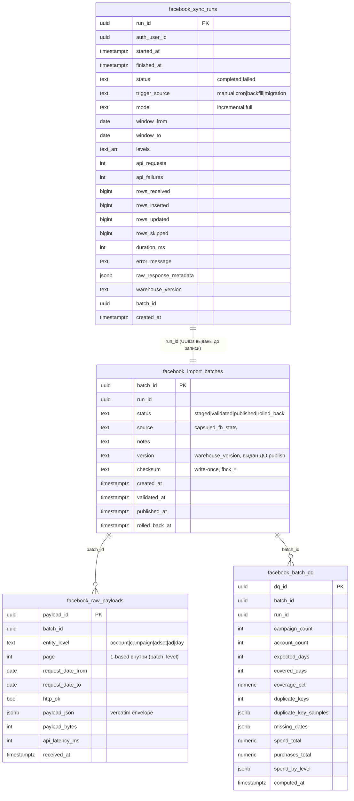

# Facebook Warehouse V2 — Phase 1 Report: Append-only Import History

- Дата: 2026-07-19
- Статус: реализовано и протестировано локально; **deploy НЕ выполнялся**, commit НЕ выполнялся
- Скоуп: только инфраструктура истории импорта. Cohorts, allocation, Facebook reconciliation, mapping и существующий импорт **не изменены**

## Что решено

| Проблема (из аудита 2026-07-19) | Решение Phase 1 |
|---|---|
| Sync history теряется | `facebook_sync_runs`: одна immutable-строка на каждый запуск (успех и провал) |
| State перезаписывается | Новые таблицы append-only; UPDATE/DELETE отвергаются DB-триггерами для любой роли, включая service_role |
| Невозможно увидеть, какие данные импортированы | `facebook_raw_payloads`: каждый ответ Capsuled API сохраняется verbatim + `facebook_batch_dq`: автоматический DQ-отчёт на каждый batch |
| Невозможно откатить импорт | `facebook_import_batches` со state machine `staged → validated → published → rolled_back`; rollback = смена статуса, данные не удаляются никогда |

Существующий pipeline (`fact_facebook_stats` в ClickHouse + upsert `clickhouse_transaction_sync_state`) продолжает работать **точно как раньше** — история пишется рядом, fail-safe: любой сбой history-слоя проглатывается и не влияет на sync (проверено тестом «history layer down → sync completes identically»).

## Новые таблицы (все в Supabase Postgres)

| Таблица | Назначение | Мутируемость |
|---|---|---|
| `facebook_sync_runs` | 1 строка = 1 запуск sync | INSERT-only (триггер блокирует UPDATE/DELETE) |
| `facebook_import_batches` | 1 строка = 1 batch импорта, версия warehouse | INSERT + только легальные переходы статуса; DELETE запрещён; identity-колонки immutable; checksum/timestamps write-once |
| `facebook_raw_payloads` | verbatim API payload на каждый запрос | INSERT-only |
| `facebook_batch_dq` | автоматический DQ-отчёт batch-а | INSERT-only |

DDL: `supabase/migrations/202607190001_create_facebook_warehouse_v2_history.sql`.

## ER diagram



Замечания по схеме:

- Поле `trigger` из ТЗ названо `trigger_source` (избегаем SQL-ключевого слова).
- FK между runs и batches нет намеренно: run-строка — это completion event, она пишется **последней**, batch — первым. FK инвертировал бы порядок записи. Целостность обеспечивается тем, что оба UUID генерируются рекордером до первой записи; порядок записи задокументирован в шапке миграции.
- RLS: у клиентов только `SELECT` собственных строк. Insert/update-политик нет — пишет только Edge Function (service role), и даже она не может UPDATE/DELETE append-only таблицы из-за триггеров.

## Как пишется история (поток одного sync)

```
runFacebookStatsSync (существующий, поведение не изменено)
  │
  ├─ stageBatch()            → INSERT batches (status=staged, version=fbwh_*)   ← version ДО publish (§5)
  ├─ wrapFetcher()           → каждый API request буферизуется и bulk-INSERT-ится
  │                            в raw_payloads (verbatim envelope; ошибки — {error}, http_ok=false)
  ├─ [validation gate OK]    → UPDATE batches: staged → validated (+checksum)
  ├─ [ClickHouse insert OK]  → INSERT batch_dq (авто-DQ) ; UPDATE batches: validated → published
  ├─ [любой сбой]            → UPDATE batches: → rolled_back (+notes) ; данные НЕ удаляются
  └─ recordRun()             → INSERT sync_runs (единственная запись, больше не трогается)
```

Каждый вызов history обёрнут в fail-safe: ошибки копятся в `history_errors` (новое опциональное поле ответа sync) и никогда не пробрасываются в pipeline.

## Read-only API (edge `clickhouse-facebook`, новые actions)

| Action | Возвращает |
|---|---|
| `history_runs` | Sync History (фильтр по status, limit ≤ 200) |
| `history_batches` | Import Batches (фильтр по run_id/status) |
| `history_versions` | Warehouse Versions (ledger batch-ей по version) |
| `history_raw_payloads` | метаданные payload-ов batch-а; либо один полный payload по `payload_id` |
| `history_dq` | DQ-отчёт batch-а |

Все — чистые SELECT из Postgres, ClickHouse не трогают, выполняются до создания CH-клиента. Фронтенд-обёртки: `src/services/fbWarehouseHistory.ts` (ни один существующий UI-модуль их пока не использует — п.7 ТЗ: к Cohorts не подключено).

## Примеры

### Один sync (строка `facebook_sync_runs`)

```json
{
  "run_id": "0c6a…", "started_at": "2026-07-19T14:01:26.505Z", "finished_at": "2026-07-19T14:01:32.350Z",
  "status": "completed", "trigger_source": "manual", "mode": "incremental",
  "window_from": "2026-07-17", "window_to": "2026-07-19",
  "levels": ["account","campaign","adset","ad","day"],
  "api_requests": 13, "api_failures": 0,
  "rows_received": 412, "rows_inserted": 4, "rows_updated": 408, "rows_skipped": 0,
  "duration_ms": 5845, "error_message": null,
  "raw_response_metadata": { "api_payload_bytes": 1873400, "range_splits": 0, "fb_stats_to": "2026-07-18",
    "merged_rows_detected": 0, "day_spend_total": 3040.21, "active_days": 3, "strategy": "per_day_entity_fetch" },
  "warehouse_version": "fbwh_lxyz12ab", "batch_id": "9f2e…"
}
```

### Один batch (строка `facebook_import_batches`)

```json
{
  "batch_id": "9f2e…", "run_id": "0c6a…", "status": "published",
  "source": "capsuled_fb_stats", "notes": null,
  "version": "fbwh_lxyz12ab", "checksum": "fbck_1h7q9zk_412",
  "created_at": "2026-07-19T14:01:26.7Z", "validated_at": "2026-07-19T14:01:31.2Z",
  "published_at": "2026-07-19T14:01:32.1Z", "rolled_back_at": null
}
```

Провалившийся sync оставляет тот же след, но `status="failed"` в run, batch `rolled_back` с причиной в `notes`, и все raw payloads на месте (post-mortem вместо потерянного state, как было с failed run 2026-07-05).

### Один raw payload (строка `facebook_raw_payloads`)

```json
{
  "payload_id": "77b1…", "batch_id": "9f2e…",
  "entity_level": "campaign", "page": 2,
  "request_date_from": "2026-07-18", "request_date_to": "2026-07-18",
  "http_ok": true, "payload_bytes": 48211, "api_latency_ms": 402,
  "payload_json": { "ok": true, "currency": "USD",
    "dataFreshness": { "fbStatsTo": "2026-07-18", "lastImportAt": "2026-07-19T13:58:00.1Z" },
    "rows": [ { "dateFrom": "2026-07-18", "dateTo": "2026-07-18", "campaignId": "120249115818080040", "spend": 249.27, "fbPurchases": 6 } ]
  },
  "received_at": "2026-07-19T14:01:29.8Z"
}
```

### DQ report (строка `facebook_batch_dq`)

```json
{
  "batch_id": "9f2e…", "run_id": "0c6a…",
  "campaign_count": 87, "account_count": 18,
  "expected_days": 3, "covered_days": 3, "coverage_pct": 100,
  "duplicate_keys": 0, "duplicate_key_samples": [], "missing_dates": [],
  "spend_total": 3040.21, "purchases_total": 92,
  "spend_by_level": { "day": 3040.21, "account": 3040.21, "campaign": 3040.21, "adset": 3040.21, "ad": 3040.21 }
}
```

## Тесты (spec §9) — все зелёные

`src/test/fbWarehouseV2History.test.ts`, 17 тестов:

- append-only: на runs/raw/dq уходят только INSERT; UPDATE/DELETE не существуют в коде рекордера и блокируются DDL-триггерами (проверено и по операциям, и по тексту миграции);
- каждый sync создаёт **новый** run (два подряд запуска → два разных run_id, две записи);
- каждый run создаёт batch; переходы только staged→validated→published / →rolled_back; нелегальный переход отвергается без UPDATE;
- rollback не удаляет данные: batch остаётся, raw payloads остаются, DQ при провале не пишется;
- warehouse_version присваивается на staged-этапе, до publish (§5);
- fail-safe: при полностью недоступном history-слое sync завершается идентично (тот же CH insert, тот же state, `rows_inserted` совпадает);
- read API: скоупинг по auth_user_id, clamp limit, обязательный uuid для payload-доступа;
- DDL-инварианты миграции: 4 таблицы, триггеры `before update or delete`, только select-политики RLS.

Полный сьют: **104 файла, 1366 тестов — все проходят**; `eslint` и `tsc --noEmit` — чисто.

## Подтверждение неизменности production-логики

| Область | Файлы | Статус |
|---|---|---|
| Cohorts | `cohortMembership.ts`, `cohorts.ts`, `Cohorts.tsx`, `cohortsDataSource.ts` | не тронуты |
| Allocation | `fbCohortStats.ts` | не тронут |
| FB reconciliation / diagnostics | `fbAllocationDiagnostics.ts`, `fbSourceClassification.ts` | не тронуты |
| Mapping | `fbSourceClassification.ts` (aliases), `userMediaBuyer.ts`, `mediaBuyerSelection.ts` | не тронуты |
| Существующий импорт | fetch-стратегия, validation gate, CH insert, state upsert в `facebookStats.ts` | логика не изменена; добавлены только fail-safe history-вызовы вокруг существующих шагов |
| Legacy pipeline | `capsuled-facebook-sync`, `capsuled_facebook_*` | не тронуты |

Изменения в существующих файлах — строго аддитивные:

- `facebookStats.ts`: создание рекордера, обёртка fetcher-а (pass-through), 5 fail-safe вызовов history, 3 новых опциональных поля в ответе sync (`history_run_id`, `history_batch_id`, `history_errors`);
- `clickhouse-facebook/index.ts`: 5 новых read-only actions до CH-клиента; существующие actions не изменены;
- `types.ts`: опциональные `insert`/`update` в `SupabaseQueryBuilder` (старые фейки/клиенты остаются валидными).

Ни одна бизнес-метрика не вычисляется из новых таблиц; ни один существующий читатель их не видит. Существующие 1349 тестов (включая все Cohorts/allocation/reconciliation-сьюты) проходят без единого изменения в них самих.

## Файлы Phase 1

Новые:
- `supabase/migrations/202607190001_create_facebook_warehouse_v2_history.sql`
- `supabase/functions/_shared/clickhouse/fbSyncHistory.ts`
- `src/services/fbWarehouseHistory.ts`
- `src/test/fbWarehouseV2History.test.ts`

Изменённые (аддитивно):
- `supabase/functions/_shared/clickhouse/facebookStats.ts`
- `supabase/functions/clickhouse-facebook/index.ts`
- `supabase/functions/_shared/clickhouse/types.ts`

## Deploy checklist (когда будет решено деплоить)

1. Применить миграцию `202607190001_…` (только новые объекты, ничего не меняет в существующих таблицах).
2. Задеплоить функцию `clickhouse-facebook` (подтянет `fbSyncHistory.ts` из `_shared`).
3. Прогнать один `incremental` sync из UI → проверить `history_runs`/`history_batches`/`history_dq` через новые actions.
4. До применения миграции история просто не пишется (fail-safe), sync работает как раньше — порядок деплоя безопасен в любом направлении.
